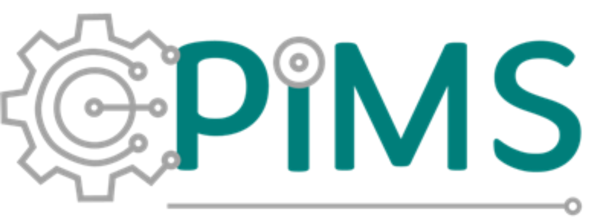

# PIMS Unified Interface – Radix/Vale

> **Central de Apoio PIMS** – uma interface gráfica desenvolvida para integrar e otimizar o trabalho do time de **PIMS (Plant Information Management System)** da **Radix/Vale**.

---

## 🎯 Objetivo do Projeto

A **PIMS Unified Interface** foi criada com o propósito de **centralizar as principais ferramentas, planilhas e acessos do time de PIMS** em uma única aplicação, promovendo:

- 🚀 **Otimização do tempo** – reduzindo a necessidade de buscar manualmente arquivos e links na nuvem.  
- 🧩 **Integração inteligente** – reunindo dados e sistemas utilizados pelo time em um só ambiente.  
- 💡 **Interface moderna e acessível** – com foco na simplicidade e na experiência do usuário.  
- ⚙️ **Expansibilidade** – permitindo adicionar novos módulos e integrações conforme o time evolui.

---

## 🖥️ Interface

A tela principal foi projetada com base nos princípios de **usabilidade corporativa**, mantendo um visual limpo e intuitivo.

| Seção | Descrição |
|-------|------------|
| 👥 **Fila Catalogadas** | Acesso rápido às filas monitoradas pelo time de PIMS. |
| 📋 **Planilha de Controle** | Visualização e atualização centralizada dos registros internos. |
| 🗂️ **Acessos** | Central de links, diretórios e ferramentas utilizadas no dia a dia. |
| 📝 **Chamados** | Facilita o acompanhamento e gerenciamento de tickets e demandas. |

Na parte inferior, são exibidos os logotipos **Radix** e **Vale**, reforçando a identidade institucional do projeto.

---

## ⚙️ Tecnologias Utilizadas

- 🐍 **Python 3.11+**  
- 🖼️ **PySide6 (Qt for Python)** – criação da interface gráfica  
- 🎨 **QSS (Qt Stylesheet)** – personalização visual (base #008075 com transparência)  
- 🧩 **Qt Designer** – prototipagem e design de telas  
- 🧭 **pyside6-rcc** – compilação de recursos `.qrc`

---

## 🗂️ Estrutura do Projeto

